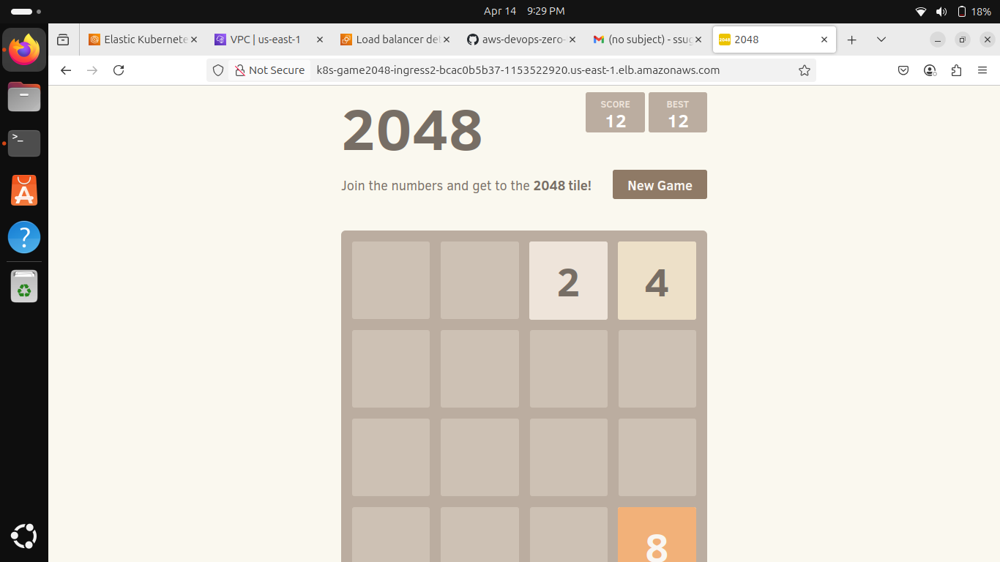

# 🎮 2048 Game Application – DevOps Deployment Project

This project demonstrates how to deploy the popular 2048 Game application using Kubernetes on AWS EKS. It is part of the real-time DevOps practice, focused on building, containerizing, and deploying a frontend-based application in a production-ready environment.

---

## 📌 Project Details

- **Project Goal**: Deploy the 2048 game app using Kubernetes on AWS EKS (Elastic Kubernetes Service) as part of hands-on     DevOps training.
- **Deployment Target**: AWS Cloud – EKS Cluster
- **Containerization**: Docker
- **Orchestration**: Kubernetes (with `kubectl`, `eksctl`, `AWS CLI`)
- **CI/CD Practice**: Manual steps using real-time tools and YAML manifests

---

## 📂 Project Structure

2048-game-app/ ├── README.md ├── screenshots/ │ ├── final-output-picture-of-2048-game-app.png │ └── final-output-video-of-my-2048-app.webm

---

## 📸 Output Screenshot

🎥 **Demo Video**  
[Screencast Output Video](./screenshots/final-output-video-of-my-2048-app.webm)

---

## 🔗 Source Code Reference

- **Original Project Repo**:  
  [Abhishek Veeramalla – DevOps Zero to Hero (Day 22)](https://github.com/iam-veeramalla/aws-devops-zero-to-hero/tree/main/day-22)

- **My Forked Repo** (with deployment practice):  
  [Suganya’s Practice Repository – Day 22](https://github.com/suganya-subramanian/aws-devops-zero-to-hero/tree/main/day-22)

---

## 🧠 What I Practiced

- Spinning up an EKS Cluster using `eksctl`
- Building and pushing Docker images
- Creating deployment and service YAMLs
- Accessing apps via LoadBalancer service in AWS
- Working with `kubectl` to manage pods, deployments, and services

---

## 🙏 Acknowledgement

All credits go to **Abhishek Veeramalla Sir** for his incredible "AWS DevOps Zero to Hero" course.  
I forked the repository and practiced it on my local system to gain real-time hands-on experience.  
This project is part of my **DevOps learning journey**.

---

✅ Maintained by [Suganya Subramanian](https://github.com/suganya-subramanian)
