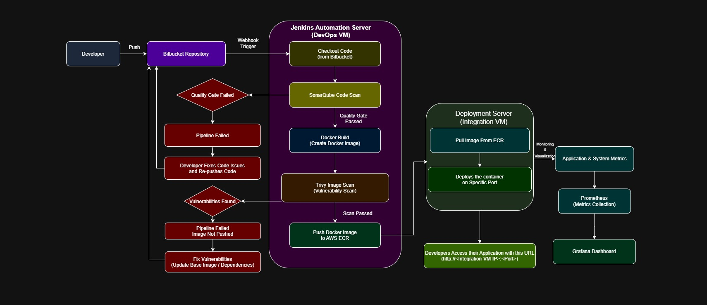

# End-to-End DevOps Infrastructure & CI/CD Pipeline

## Project Overview

This project demonstrates a **complete DevOps infrastructure setup and automated CI/CD pipeline** implemented during my **Software Engineer Internship (DevOps) at JOGO Consulting LLP** for the client **Hashira Fintech (Singapore)**.

The objective of this project was to automate the **build, security scanning, containerization, deployment, and monitoring processes** for a fintech application while ensuring **code quality, security, and observability**.

---

## Architecture Diagram

---

## Infrastructure Setup

A complete DevOps environment was provisioned on **AWS** to support development, CI/CD automation, and deployment workflows.

### AWS Infrastructure Components

- **Developer VM**
  - Used by developers to write and push code to the Bitbucket repository.

- **DevOps VM**
  - Hosts **Jenkins** and **SonarQube** for CI/CD automation and code quality analysis.

- **Integration / Deployment VM**
  - Pulls Docker images from AWS ECR.
  - Runs the application containers.

- **AWS Elastic Container Registry (ECR)**
  - Secure container registry used for storing Docker images.

- **Monitoring Stack**
  - Prometheus
  - Loki
  - Promtail
  - Grafana

---

## CI/CD Pipeline Workflow

### 1. Code Push
Developers push application code to the **Bitbucket repository**.

### 2. Webhook Trigger
Bitbucket webhook automatically triggers the **Jenkins pipeline**.

### 3. Code Checkout
Jenkins checks out the latest code from the Bitbucket repository.

### 4. Code Quality Analysis
**SonarQube** performs static code analysis and enforces **Quality Gates**.

If the quality gate fails:

- The pipeline stops
- The developer fixes the code and pushes again

### 5. Docker Image Build
Jenkins builds a **Docker image** for the application.

### 6. Container Security Scan
**Trivy** scans the Docker image for vulnerabilities.

If vulnerabilities are found:

- The pipeline fails
- The developer updates dependencies or base images

### 7. Push Image to AWS ECR
If the scan passes, the Docker image is pushed to **AWS Elastic Container Registry (ECR)**.

### 8. Application Deployment
The **Integration Server** pulls the Docker image from ECR and runs the container on a specific port.

Example application access:
