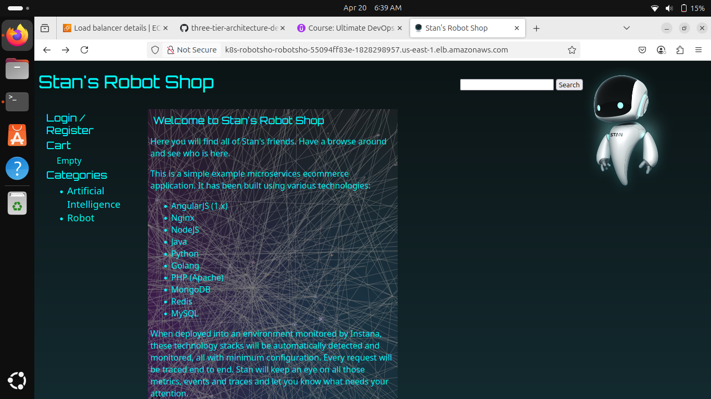

# RobotShop E-commerce Application – Deployment on AWS EKS

This project is a real-time e-commerce microservices application called **RobotShop**, deployed on **AWS EKS** as part of the *AWS Zero to Hero* series by Abhishek Veeramalla. I have practiced this project by forking the original repository and executing the setup in my local and cloud environments.

---

## Screenshots & Demo

| Screenshot | Demo Video |
|------------|------------|
|  | [🎥 Click to Watch Demo](./screenshots/final-output-video-robot-shop-ecommerce-three-tier-application-on-AWS-EKS.webm) |

---

## Project Structure

This project follows a **three-tier architecture** pattern with the following components:

- **Frontend** – Web UI (microservice)
- **Backend** – REST APIs for different services (catalogue, cart, user, shipping, etc.)
- **Database Layer** – MongoDB, MySQL, Redis, etc.
- **Infrastructure** – Managed with Kubernetes manifests, deployed on AWS EKS.

---

## Tools & Technologies Used

- **AWS EKS**
- **Helm**
- **Kubernetes**
- **Docker**
- **Terraform** (optional)
- **Monitoring** – Prometheus, Grafana
- **CI/CD** – GitHub Actions (future integration)
- **Ingress Controller** – NGINX

---

## 📦 Source Code

- 🔗 **Original Repository by Abhishek Veeramalla:**  
  [https://github.com/iam-veeramalla/three-tier-architecture-demo](https://github.com/iam-veeramalla/three-tier-architecture-demo)

- 🔗 **My Forked/Practiced Repository:**  
  [https://github.com/suganya-subramanian/three-tier-architecture-demo](https://github.com/suganya-subramanian/three-tier-architecture-demo)

---

##  Author

**Suganya Subramanian**  
GitHub: [suganya-subramanian](https://github.com/suganya-subramanian)

---
